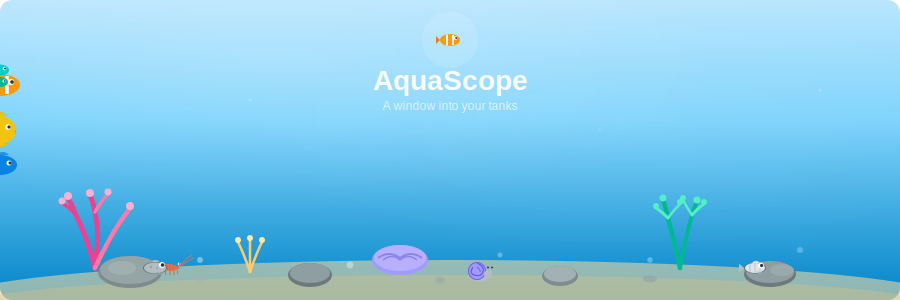

<p align="center">
  
</p>

<h1 align="center">ReefLab</h1>

<p align="center">
  <strong>A comprehensive web application for managing reef aquarium parameters, maintenance schedules, and livestock tracking.</strong>
</p>

<p align="center">
  <a href="https://github.com/eprifti/reeflab/actions/workflows/ci.yml"></a>
  <a href="LICENSE"></a>
  <a href="https://github.com/eprifti/reeflab/releases"></a>
  <a href="https://github.com/eprifti/reeflab/issues"></a>
  <a href="https://github.com/eprifti/reeflab/pulls"></a>
  <a href="https://github.com/eprifti/reeflab/stargazers"></a>
</p>

<p align="center">
  
  
  
  <a href="CONTRIBUTING.md"></a>
</p>

> **Created by [Edi Prifti](https://github.com/eprifti)** with love for the reef keeping community

## ✨ Demo & Support

- **GitHub Repository**: [github.com/eprifti/reeflab](https://github.com/eprifti/reeflab)
- **Report Issues**: [GitHub Issues](https://github.com/eprifti/reeflab/issues)
- **Discussions**: [GitHub Discussions](https://github.com/eprifti/reeflab/discussions)

### Support the Project

If you find ReefLab useful, consider supporting its development:

- ⭐ Star the repository on GitHub
- 💖 [Sponsor on GitHub](https://github.com/sponsors/eprifti)
- ☕ [Buy me a coffee on Ko-fi](https://ko-fi.com/ediprifti)
- 🐛 Report bugs and suggest features
- 🔧 Contribute code and documentation

## Features

### Core Functionality

- **Tank Management Hub**: Comprehensive tank detail views with timeline, events, and statistics
  - Individual tank pages with split-view layout
  - Tank image upload with animated fallback visualization
  - Tank events timeline for tracking changes and milestones
  - Quick actions for common tasks
  - Statistics dashboard showing equipment, livestock, photos, and test counts

- **Parameter Tracking**: Log water test results (Ca, Mg, KH, NO3, PO4, Salinity, Temperature, pH)
  - InfluxDB integration for time-series data storage
  - Visualization with Recharts in the dashboard
  - Export data to Grafana for advanced analytics

- **ICP Test Management**: Upload and track ICP-OES test results
  - Support for multiple lab providers (Triton, ATI, Fauna Marin, etc.)
  - Element-level tracking with visual indicators
  - Comparison across multiple tests
  - Detailed element analysis with scores

- **Photo Gallery**: Upload and manage aquarium photos
  - Drag-and-drop file upload
  - Thumbnail generation
  - Photo descriptions and timestamps
  - Tank-specific photo filtering

- **Notes System**: Keep detailed notes and observations about your reef tank
  - Rich text notes with timestamps
  - Tank-specific note filtering
  - Search and organize notes

- **Maintenance Reminders**: Track and schedule maintenance tasks
  - Automatic scheduling based on frequency
  - Overdue reminder notifications
  - Maintenance history tracking
  - Task templates (water changes, pump cleaning, skimmer maintenance)

- **Livestock Database**: Catalog fish, corals, and invertebrates
  - FishBase integration for species information
  - Track acquisition dates and sources
  - Monitor health and status
  - Tank-specific livestock filtering

- **Equipment Tracking**: Manage aquarium equipment
  - Equipment inventory with manufacturers and models
  - Installation dates and status tracking
  - Tank-specific equipment filtering

- **Multi-User Support**: Secure authentication and user-specific data management
  - JWT-based authentication
  - User registration and login
  - Data isolation between users

## Technology Stack

### Frontend
- React 18 with TypeScript
- Vite for fast development and optimized builds
- Tailwind CSS for modern, responsive UI
- React Router for navigation
- Axios for API communication

### Backend
- Python 3.11+ with FastAPI
- SQLAlchemy ORM with PostgreSQL
- InfluxDB2 for time-series parameter data
- JWT authentication
- Alembic for database migrations

### Infrastructure
- Docker Compose for containerized deployment
- Nginx for serving frontend and reverse proxy
- PostgreSQL 15 for relational data
- InfluxDB2 for time-series data

## Prerequisites

- Docker and Docker Compose
- Git
- (Optional) Node.js 20+ and Python 3.11+ for local development

## Quick Start

### 1. Clone the Repository

```bash
git clone https://github.com/eprifti/reeflab.git
cd reeflab
```

### 2. Configure Environment Variables

Copy the example environment file and customize it:

```bash
cp .env.example .env
```

Edit `.env` and update the following critical values:

```env
# Change these for security
POSTGRES_PASSWORD=your-secure-password
INFLUXDB_ADMIN_PASSWORD=your-secure-password
INFLUXDB_ADMIN_TOKEN=your-secure-token
SECRET_KEY=your-secret-key-for-jwt
```

### 3. Start the Application

```bash
docker-compose up -d
```

This will start all services:
- Frontend: http://localhost
- Backend API: http://localhost:8000
- InfluxDB UI: http://localhost:8086
- PostgreSQL: localhost:5432

### 4. Access the Application

Open your browser and navigate to:
- **ReefLab UI**: http://localhost
- **API Documentation**: http://localhost:8000/docs
- **InfluxDB UI**: http://localhost:8086

### 5. Initial Setup

1. Register a new user account at http://localhost/register
2. Log in with your credentials
3. Create your first tank
4. Start logging parameters!

### 6. Load Demo Data (Optional)

Seed the database with two fully configured aquariums (saltwater SPS reef + freshwater Amazonian biotope) including livestock, equipment, maintenance schedules, notes, and months of parameter history:

```bash
bash scripts/seed_demo.sh
```

Then log in with:
- **Email**: `demo@reeflab.io`
- **Password**: `demo1234`

## Grafana Integration

### Configure Grafana Datasource

1. In Grafana, add a new InfluxDB datasource
2. Configure the connection:
   - **URL**: `http://influxdb:8086` (if Grafana is in the same Docker network) or `http://localhost:8086`
   - **Organization**: `reeflab` (or value from `INFLUXDB_ORG`)
   - **Token**: Use the value from `INFLUXDB_ADMIN_TOKEN` in your `.env`
   - **Default Bucket**: `reef_parameters` (or value from `INFLUXDB_BUCKET`)

3. Test and save the datasource

### Query Parameters

Your parameter data is stored in InfluxDB with the following structure:

- **Measurement**: `reef_parameters`
- **Tags**:
  - `user_id`: User identifier
  - `tank_id`: Tank identifier
  - `parameter_type`: Type of parameter (calcium, magnesium, alkalinity_kh, nitrate, phosphate, salinity, temperature, ph)
- **Field**: `value` (float)

Example Flux query:

```flux
from(bucket: "reef_parameters")
  |> range(start: -30d)
  |> filter(fn: (r) => r["_measurement"] == "reef_parameters")
  |> filter(fn: (r) => r["parameter_type"] == "calcium")
```

## Development

### Backend Development

```bash
cd backend
python -m venv venv
source venv/bin/activate  # On Windows: venv\Scripts\activate
pip install -r requirements.txt
uvicorn app.main:app --reload
```

### Frontend Development

```bash
cd frontend
npm install
npm run dev
```

The frontend will be available at http://localhost:3000 with hot-reload enabled.

### Testing

ReefLab includes comprehensive unit and integration tests for both backend and frontend.

**Backend Tests (Pytest)**:
```bash
cd backend
pytest                    # Run all tests
pytest -m unit           # Run only unit tests
pytest -m integration    # Run only integration tests
pytest --cov=app         # Run with coverage report
```

**Frontend Tests (Vitest)**:
```bash
cd frontend
npm test                 # Run all tests
npm run test:ui         # Run with interactive UI
npm run test:coverage   # Run with coverage report
```

For detailed testing documentation, see [TESTING.md](docs/TESTING.md).

### Continuous Integration

ReefLab uses GitHub Actions for automated testing and quality assurance. Every push and pull request triggers:

1. **Backend Tests**: Pytest suite with PostgreSQL service container
2. **Frontend Tests**: TypeScript type checking and Vite build verification
3. **Docker Build**: Validates that both frontend and backend Docker images build successfully

The CI pipeline ensures code quality and prevents regressions. View the [workflow file](.github/workflows/ci.yml) for details.

### Database Migrations

Create a new migration:

```bash
cd backend
alembic revision --autogenerate -m "Description of changes"
```

Apply migrations:

```bash
alembic upgrade head
```

## Project Structure

```
reeflab/
├── backend/               # FastAPI backend
│   ├── app/
│   │   ├── api/          # API endpoints
│   │   ├── core/         # Core configuration and security
│   │   ├── models/       # SQLAlchemy models
│   │   ├── schemas/      # Pydantic schemas
│   │   └── services/     # External service integrations
│   ├── alembic/          # Database migrations
│   └── Dockerfile
├── frontend/             # React frontend
│   ├── src/
│   │   ├── components/   # React components
│   │   ├── pages/        # Page components
│   │   ├── api/          # API client
│   │   └── hooks/        # Custom React hooks
│   └── Dockerfile
├── docker-compose.yml    # Docker orchestration
└── README.md
```

## API Documentation

Once the backend is running, visit http://localhost:8000/docs for interactive API documentation powered by Swagger UI.

### Key Endpoints

- `POST /api/v1/auth/register` - Register new user
- `POST /api/v1/auth/login` - Login and get JWT token
- `GET /api/v1/tanks` - List user's tanks
- `POST /api/v1/parameters` - Submit water test results
- `GET /api/v1/parameters` - Query parameter history
- `POST /api/v1/photos` - Upload photos
- `POST /api/v1/maintenance/reminders` - Create maintenance reminder

For complete API documentation, see [docs/API.md](docs/API.md) and [docs/API_GUIDE.md](docs/API_GUIDE.md).

## FishBase Integration

The livestock feature integrates with the FishBase API to provide species information. When adding fish or corals, you can search the FishBase database for accurate species data.

## Contributing

1. Fork the repository
2. Create a feature branch (`git checkout -b feature/amazing-feature`)
3. Commit your changes (`git commit -m 'feat: add amazing feature'`)
4. Push to the branch (`git push origin feature/amazing-feature`)
5. Open a Pull Request

## Commit Convention

This project follows conventional commits:

- `feat:` New feature
- `fix:` Bug fix
- `docs:` Documentation changes
- `style:` Code style changes (formatting, etc.)
- `refactor:` Code refactoring
- `test:` Adding or updating tests
- `chore:` Maintenance tasks

## Troubleshooting

### Containers won't start

Check Docker logs:
```bash
docker-compose logs
```

### Database connection errors

Ensure PostgreSQL is healthy:
```bash
docker-compose ps
```

Wait for the health check to pass, then restart the backend:
```bash
docker-compose restart backend
```

### InfluxDB token issues

Generate a new token in the InfluxDB UI and update your `.env` file.

## License

MIT License - see LICENSE file for details

## Support

For issues and questions:
- GitHub Issues: https://github.com/eprifti/reeflab/issues
- Discussions: https://github.com/eprifti/reeflab/discussions

## Features Status

## Documentation

Comprehensive documentation is available in the [docs/](docs/) folder:

- **[Quick Start Guide](docs/QUICK_START.md)** - Get up and running quickly
- **[API Documentation](docs/API.md)** - Complete API reference
- **[API Usage Guide](docs/API_GUIDE.md)** - API integration examples
- **[Deployment Guide](docs/DEPLOYMENT.md)** - Deployment instructions
- **[Testing Guide](docs/TESTING.md)** - Running tests and writing new ones
- **[ICP Testing](docs/ICP_TESTING.md)** - ICP test management features
- **[Photo Features](docs/PHOTO_FEATURES.md)** - Photo gallery features
- **[Changelog](docs/CHANGELOG.md)** - Version history and changes
- **[Release Notes](docs/RELEASE_NOTES_v1.0.0.md)** - Detailed release information

### ✅ Completed (v1.5.1)
- ✅ Tank management hub with detail views and timeline
- ✅ Tank image upload with animated fallback visualization
- ✅ ICP test management with element tracking
- ✅ Parameter tracking with InfluxDB integration
- ✅ Equipment tracking and inventory management
- ✅ Maintenance reminder system with automatic scheduling
- ✅ Photo gallery with drag-and-drop upload
- ✅ Notes/journal system
- ✅ Livestock inventory with FishBase/WoRMS/iNaturalist integration
- ✅ Livestock split feature (split groups by status)
- ✅ Multi-user authentication and authorization
- ✅ Responsive UI with Tailwind CSS
- ✅ Data visualization with Recharts
- ✅ Excel/CSV import for historical data
- ✅ GitHub Actions CI/CD pipeline with automated tests
- ✅ Comprehensive unit and integration tests (121 tests, 60% coverage)
- ✅ Multi-language support (EN, FR, ES, DE, IT, PT)
- ✅ Animated aquarium scene with fish, corals, and bottom dwellers
- ✅ Custom logo and branding

### 🎯 Roadmap

- [ ] Email notifications for maintenance reminders
- [ ] Mobile responsive design improvements
- [ ] Dosing calculator
- [ ] Water change calculator
- [ ] Cost tracking and equipment expenses
- [ ] Community features (share tanks publicly)
- [ ] Integration with reef controllers (ReefPi, Neptune)
- [ ] Mobile app (React Native)
- [ ] Advanced analytics and trend prediction
- [ ] Automatic parameter recommendations based on tank type
- [ ] Real-time parameter monitoring with IoT integration

---

## Credits & Acknowledgments

**ReefLab** is created and maintained by **[Edi Prifti](https://github.com/eprifti)**.

Built with:
- ❤️ Passion for reef keeping and open-source software
- 🤖 [Claude Sonnet 4.5](https://claude.ai) by Anthropic
- 🌊 Inspiration from the amazing reef keeping community

### Technologies

Special thanks to the open-source projects that make ReefLab possible:
- [FastAPI](https://fastapi.tiangolo.com/) - Modern Python web framework
- [React](https://react.dev/) - UI library
- [PostgreSQL](https://www.postgresql.org/) - Relational database
- [InfluxDB](https://www.influxdata.com/) - Time-series database
- [Docker](https://www.docker.com/) - Containerization
- And many more amazing tools and libraries

### Contributing

Contributions are welcome! Whether it's:
- 🐛 Bug reports and fixes
- ✨ New features
- 📝 Documentation improvements
- 🎨 UI/UX enhancements
- 🧪 Test coverage

See [CONTRIBUTING.md](CONTRIBUTING.md) for guidelines.

### Support

If you find ReefLab useful:
- ⭐ Star the repository
- 💖 [Sponsor on GitHub](https://github.com/sponsors/eprifti)
- ☕ [Buy me a coffee](https://ko-fi.com/ediprifti)
- 📢 Share with other reef keepers
- 🐛 Report bugs and suggest features

---

Made with ❤️ for the reef keeping community
